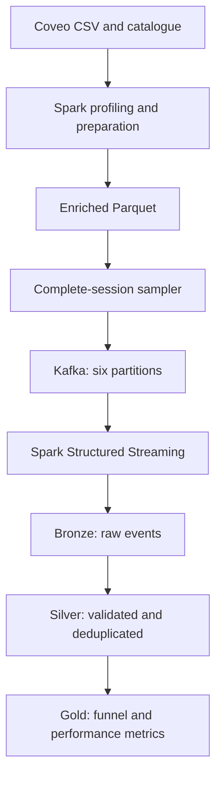

# Luxury Retail Streaming Platform

[](https://github.com/fatemeh-Salmani1/luxury-retail-streaming-platform/actions/workflows/ci.yml)

An event-driven Data Engineering project using Apache Kafka and Spark Structured Streaming to process fictional and real anonymized e-commerce activity.

The project combines controlled synthetic customer journeys with the 36-million-event Coveo SIGIR e-commerce dataset.

## Objectives

- Build a real-time Kafka and Spark pipeline
- Process data using Spark batch transformations
- Replay historical events through Kafka
- Preserve event order using session-based message keys
- Implement Bronze, Silver and Gold data layers
- Handle invalid, duplicated and incomplete data
- Produce analytics-ready retail metrics
- Validate transformations with automated tests and CI

## Architecture




## Dataset

The project uses the anonymized [Coveo SIGIR eCommerce 2021 dataset](https://github.com/coveooss/SIGIR-ecom-data-challenge).

Source statistics:

| Metric | Value |
|---|---:|
| Browsing events | 36,079,307 |
| Approximate sessions | 5.03 million |
| Approximate products | 62,346 |
| Product-related events | 10,431,611 |
| General page views | 25,647,696 |
| Product-detail views | 9,707,890 |
| Cart additions | 329,557 |
| Cart removals | 316,316 |
| Purchases | 77,848 |


## Processing workflow

### 1. Profiling

Spark profiles the 5.9 GB browsing CSV using an explicit schema and approximate distinct counts.

On the development machine, the complete scan finished in approximately 37 seconds.

### 2. Batch preparation

Spark:

- Filters product-related activity
- Maps source actions to standardized event types
- Converts epoch milliseconds to UTC timestamps
- Creates deterministic event identifiers
- Enriches events with catalogue categories and price buckets
- Writes partitioned Parquet

This reduced approximately 5.9 GB of CSV input to 1.1 GB of prepared Parquet.

### 3. Kafka replay

A deterministic session hash selects complete customer sessions.

The current demonstration replay contains:

| Metric | Value |
|---|---:|
| Kafka events | 50,910 |
| Complete sessions | 16,260 |
| Kafka partitions | 6 |
| Product views | 47,751 |
| Cart additions | 1,528 |
| Cart removals | 1,305 |
| Purchases before deduplication | 326 |

The session ID is used as the Kafka message key, keeping events from the same journey in the same partition and preserving their order.

### 4. Bronze layer

The Bronze layer preserves the original Kafka message and operational metadata:

- Raw JSON
- Kafka topic
- Partition
- Offset
- Kafka timestamp
- Ingestion timestamp
- Ingestion date

All 50,910 Kafka records reached Bronze with continuous partition offsets.

### 5. Silver layer

Silver applies:

- Explicit JSON parsing
- Required-field validation
- Event-type validation
- Kafka key and session consistency checks
- Price-bucket validation
- Event-time watermarking
- Stateful duplicate removal
- Event-date partitioning

Silver produced 50,903 unique records, removing seven exact duplicates:

- Four product views
- Three purchases

Missing catalogue attributes remain `NULL`; the pipeline does not invent unavailable information.

### 6. Gold layer

Gold produces:

- Customer-funnel metrics
- Category-performance metrics
- Price-segment metrics

Current complete-session results:

| Metric | Value |
|---|---:|
| Unique events | 50,903 |
| Sessions | 16,260 |
| Products | 10,552 |
| Cart sessions | 1,022 |
| Purchase sessions | 230 |
| View-to-cart rate | 6.29% |
| Purchase conversion rate | 1.41% |
| Cart-to-purchase rate | 22.50% |


## Technology stack

- Python 3.12
- Apache Kafka 4.1
- Apache Spark and PySpark 4.2
- Spark Structured Streaming
- Docker Compose
- Parquet
- Pydantic
- Confluent Kafka Python client
- pytest
- Ruff
- GitHub Actions
- uv


## Local setup

Requirements:

- Docker Desktop
- Java 17
- Python 3.12
- uv

Install dependencies:

```bash
uv sync --locked --dev
```

Start Kafka:

```bash
docker compose -f docker/compose.yml up -d
```

## Synthetic event demonstration

Publish fictional customer journeys:

```bash
uv run python -m src.producer.kafka_producer \
  --journeys 5 \
  --delay 0.5
```

Preview Kafka events with Spark:

```bash
uv run python -m src.streaming.kafka_stream
```

## Real-data workflow

Profile the source data:

```bash
uv run python -m src.batch.profile_coveo
```

Prepare enriched Parquet:

```bash
uv run python -m src.batch.prepare_coveo_events
```

Replay complete sessions to Kafka:

```bash
uv run python -m src.batch.replay_coveo_to_kafka \
  --sample-modulus 200
```

Persist Kafka records to Bronze:

```bash
uv run python -m src.streaming.bronze_writer \
  --topic coveo-retail-events \
  --output-path data/processed/bronze/coveo_events \
  --checkpoint-path checkpoints/bronze-coveo-events
```

Build Silver:

```bash
uv run python -m src.streaming.coveo_silver_writer
```

Build Gold:

```bash
uv run python -m src.batch.coveo_gold_builder
```

## Testing

Run code-quality checks:

```bash
uv run ruff check .
```

Run all Python and Spark tests:

```bash
uv run python -m pytest -v
```

The test suite validates:

- Pydantic event contracts
- Invalid price and event-type rejection
- Customer-journey ordering
- Session consistency
- Funnel calculations
- Safe handling of zero denominators

GitHub Actions automatically runs Ruff and all nine tests after every push and pull request to `main`.

## Data Engineering concepts demonstrated

- Event-driven architecture
- Kafka brokers, topics, partitions, offsets and message keys
- Idempotent event production
- Spark batch processing
- Spark Structured Streaming
- Micro-batch processing
- Explicit schema enforcement
- Broadcast joins
- Parquet optimization
- Checkpoint-based recovery
- Event-time watermarks
- Stateful deduplication
- Bronze–Silver–Gold architecture
- Data-quality investigation
- Automated testing and continuous integration

